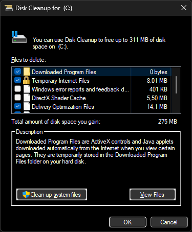

# DarkEnforcer
Win32 Dark Mode enforcer

For stable use, see [Dark titlebars enforcing app](https://github.com/ChGen/DarkTitle)

 This projects demonstrates forcing native Win32 apps to `Dark mode`. This requires a lot of work to be stable and universal, so its still a prototype. This is done by combination fo `Win32 global hooks`, `Win32 Controls subclassing` and some `UXtheme API` and also few other things, including undocumented APIs.

For undocumented APIs and structures, credits to: [ysc3839/win32-darkmod](https://github.com/ysc3839/win32-darkmode/blob/master/win32-darkmode/DarkMode.h), [rounk-ctrl gist](https://gist.github.com/rounk-ctrl/b04e5622e30e0d62956870d5c22b7017), [npp work](https://github.com/notepad-plus-plus/notepad-plus-plus/labels/dark%20mode
).

 Screenshots for MS Windows 11 22H2 cleanmgr.exe, which doesn't support dark mode out-of-the box and was put in dark by the project:
 
  
 
